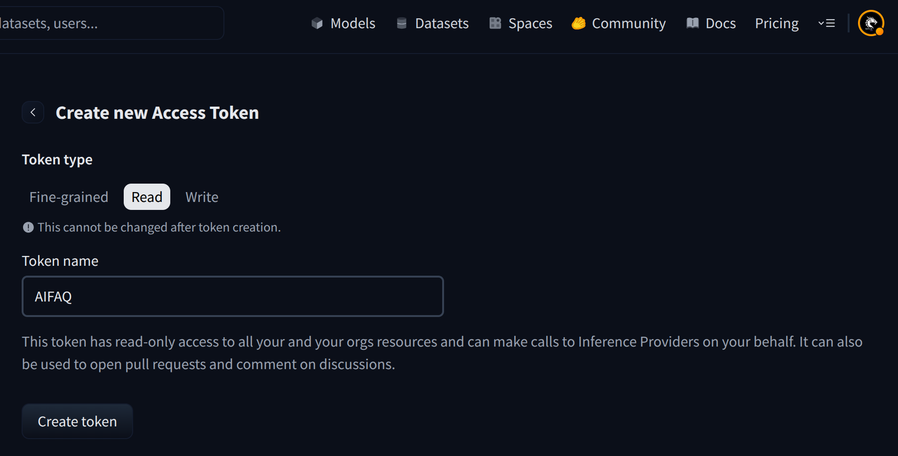

# Hyperledger Labs AIFAQ Prototype (Agents Branch)


[](https://github.com/hyperledger-labs/aifaq/stargazers)
[](https://github.com/hyperledger-labs/aifaq/network/members)
[](https://github.com/hyperledger-labs/aifaq)
[](https://github.com/hyperledger-labs/aifaq/issues)
[](https://github.com/hyperledger-labs/aifaq/pulls)


---

## 🚀 Overview

The **Hyperledger Labs AIFAQ Prototype (Agents Branch)** is an open-source conversational AI tool that simplifies knowledge discovery within vast document repositories. Our mission: to **support users, developers, and communities by providing an intuitive conversational interface** that answers questions about specific contexts—no more wading through oceans of documents!

👉 Official Wiki Pages:

- [Hyperledger Labs Wiki](https://lf-hyperledger.atlassian.net/wiki/spaces/labs/pages/20290949/AI+FAQ+2025)

👉 Weekly Community Calls:

- Every Monday (public) — join via [Hyperledger Labs Calendar](https://wiki.hyperledger.org/display/HYP/Calendar+of+Public+Meetings).

---

## 🧩 Features

- Conversational AI for targeted question answering
- Supports RAG (Retrieval Augmented Generation) for enhanced accuracy
- Easy integration via API and UI samples
- Extensible architecture for multi-agent support

---

## 🛠️ Architecture


**Workflows:**

1. **Data Ingestion:** Load context documents → create vector DB (e.g., from ReadTheDocs or GitHub issues/PRs)
2. **Chat Workflow:** Accept user queries → retrieve context → generate answer

Currently uses [Mistral Models](https://mistral.ai) (e.g., Mixtral-8x7B-v0.1). Plans to evaluate other open-source models in the future.

---

## 📝 Setup (Agents Branch)

```bash
git clone https://github.com/hyperledger-labs/aifaq.git
cd aifaq
git checkout agents
python -m venv venv
source venv/bin/activate
cd src/mvt
pip install -r requirements.txt
python create_directories.py
```

### Environment Variables

Edit your `.env` file:

```env
MISTRALAI_API_KEY=<required - get from https://auth.mistral.ai/ui/login>
OPENAI_API_KEY=<optional>
HF_TOKEN=<required - get from https://huggingface.co/settings/tokens>
```




👉 Visit [Mixtral-8x7B-v0.1 on HuggingFace](https://huggingface.co/mistralai/Mixtral-8x7B-v0.1) and request access.


### Launch

The application supports two modes of operation:

#### Production Mode (Default)
```bash
streamlit run app.py
```

**Note:** Production mode requires authentication credentials to be configured in `.streamlit/secrets.toml`. If credentials are not configured, the application will show an error message with options to either:
- Switch to development mode
- Configure the required credentials

#### Development Mode
```bash
streamlit run app.py dev
```

**Note:** Development mode provides full functionality without authentication requirements, making it ideal for testing and development.

### Authentication Configuration (Production Mode)

For production mode, you need to configure authentication credentials in `.streamlit/secrets.toml`:

```toml
# For Auth0 authentication
[auth.auth0]
domain = "your-domain.auth0.com"
client_id = "your-client-id"
client_secret = "your-client-secret"
server_metadata_url = "https://your-domain.auth0.com/.well-known/openid_configuration"
client_kwargs = { "prompt" = "login"}

# OR for Google OAuth
[auth.google]
client_id = "your-google-client-id"
client_secret = "your-google-client-secret"
server_metadata_url = "https://accounts.google.com/.well-known/openid_configuration"

# General auth settings
[auth]
redirect_uri = "your-redirect-uri"
cookie_secret = "your-cookie-secret"
```


🎉 Access the demo at: [http://3.225.169.87:8502/](http://3.225.169.87:8502/)


---

## 🌐 Open Source License

- **License:** Apache 2.0 (see [`LICENSE`](./LICENSE) and [`NOTICE`](./docs/NOTICE))
- **3rd Party Libraries:** [ASF 3rd Party License Policy](https://www.apache.org/legal/resolved.html)
- **License Assembly:** [Assembling LICENSE and NOTICE](https://infra.apache.org/licensing-howto.html#mod-notice)

---

## 🤝 Contributing

We welcome contributions! Please check our [CONTRIBUTING](./docs/CONTRIBUTING.md) guidelines and [Antitrust Policy and Code of Conduct](https://lf-hyperledger.atlassian.net/wiki/spaces/HIRC/pages/19169404/Anti-trust+Policy+Notice+Code+of+Conduct).

---

## 📆 Join Us!

Join our weekly public calls every Monday! See the [Hyperledger Labs Calendar](https://wiki.hyperledger.org/display/HYP/Calendar+of+Public+Meetings) for details.

---

## 📢 Stay Connected

- [Slack Discussions](https://join.slack.com/t/aifaqworkspace/shared_invite/zt-337k74jsl-tvH_4ct3zLj99dvZaf9nZw)
- [Hyperledger Labs Community](https://lf-hyperledger.atlassian.net/wiki/spaces/labs/pages/20290949/AI+FAQ+2025)
- Official Website: [aifaq.pro](https://aifaq.pro)

---

## ⭐️ Star Graph


